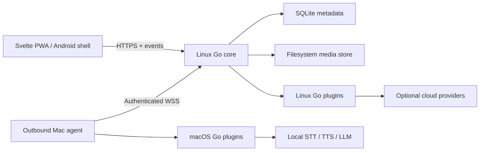

# Doublangu Core And Language Learning Platform

Build Doublangu as a self-hosted, single-user language-learning media system with a small Go core, a Svelte 5/SvelteKit UI, native trusted Go plugins, trusted same-origin UI plugins, a Linux coordination/streaming server, and an outbound Mac processing agent. The first language pair is Dutch source content with English translation and explanations, but all core records and contracts use BCP-47 language tags and must support additional languages without schema changes.

The product imports audiobooks, ordinary audio, ebooks, text files, pasted text, and URLs; preserves source media; creates or aligns sentence-level text; translates it; detects grammatical constructions and multiword expressions; generates visual and audio explanations; synthesizes speech; composes passive-listening lesson sequences; and provides synchronized reading, editing, discovery, and playback on desktop, PWA, and Android.

Audiobookshelf and its Capacitor app are design references for library scanning, chapter-aware streaming, progress synchronization, offline downloads, and server-connected mobile behavior. They are not dependencies, forks, database sources, or API compatibility targets. The `tglide/svelte-radial-menu` project is an interaction reference only. Doublangu owns a new accessible, multilevel radial command system.

The native backend plugin mechanism intentionally uses Go's `plugin` package. Because native Go plugins require an exact toolchain, build configuration, and common dependency graph match, the server/agent and every native plugin in a release must be built together. Plugins are trusted and unsandboxed. Compatibility contracts provide modularity and deterministic behavior, not a security boundary.

## Local owner foundation

The Go core requires `DOUBLANGU_SECRET`: a base64-encoded random value that
decodes to at least 32 bytes. `DOUBLANGU_DB_PATH` defaults to
`data/doublangu.db`; its parent is created at startup, so a custom path does
not depend on `DOUBLANGU_DATA_PATH`. `DOUBLANGU_PUBLIC_URL` defaults to
loopback HTTP for development. HTTPS public URLs always require secure session
cookies; `DOUBLANGU_SESSION_SECURE=false` is rejected in that configuration.

Create the only owner without placing a password in shell history or process
arguments; the command hides terminal input and accepts stdin deliberately for
automation. `--create-owner` and `--reset-owner` are mutually exclusive. A
reset replaces the password and revokes every existing session.

```sh
go run ./cmd/doublangu-server --create-owner
printf '%s\n' "$DOUBLANGU_OWNER_PASSWORD" | go run ./cmd/doublangu-server --reset-owner
```

The login page first requests `GET /api/v1/auth/csrf`, reads its same-origin
`csrf_token` cookie, and sends it back in `X-CSRF-Token` for login and logout.
Successful login sets an HttpOnly `doublangu_session` cookie, rotates any valid
presented session, and refreshes CSRF. Owner-only UI contribution metadata and
plugin assets require that session. JSON API failures use the `error` plus
versioned `code` envelope documented in `contracts/openapi.yaml`.



### Checkpoint And Commit Ownership

- Implementation agents must not stage or commit checkpoint work.
- The reviewer model owns checkpoint acceptance, staging, and commits.
- A later checkpoint must not begin until the reviewer has accepted and committed the prior checkpoint.
- The first accepted commit for each checkpoint uses `v01`. A correction after an existing checkpoint commit uses `v02`, then `v03`, and so on.
- The original plan remains the durable ledger under `plans/in-progress/` for the entire handoff.

### DevOps Ownership Boundary

Deployment work is explicitly outside this handoff. Implementing and reviewer agents must not edit the external `evreniops` repository, Ansible files, production nginx/systemd configuration, DNS, TLS, VPS state, cloud storage, or production secrets.

The project owner/architect will separately implement and operate Ansible deployment after the application produces the release artifacts and deployment contract defined in Checkpoint 15. Current hosting is a single Ubuntu 24.04 ARM64 VPS with 2 cores, 3.7 GiB RAM, no swap, and approximately 25 GiB free. It is suitable for the Go server and lightweight media operations, not AI inference or a large audiobook corpus. Production media storage therefore remains a configurable filesystem mount whose volume provisioning is an owner-operated decision.
